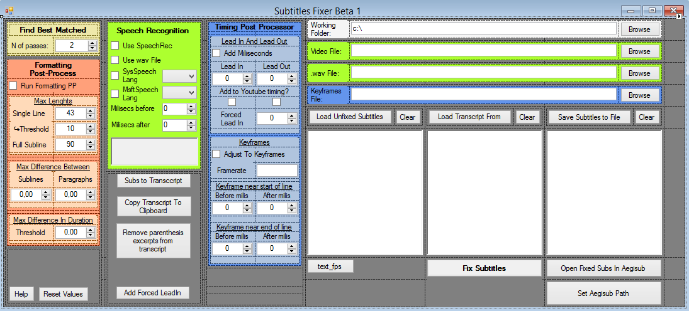

# Subtitles Auto Timer and Formatter

  

An old program to automatically take a video script, and create timed and formatted subtitles from it.

It takes as input the video, and based on the difference between frames and audio, tries to fit in the subtitles with the best formatting and timing it can.

Was useful when youtube still didn't do this kind of stuff automatically, and machine learning wasn't really a thing (circa 2015). It's pretty much abandonware at this point.

It depends on Microsoft.Speech, which is included in Microsoft Speech SDK. However, Microsoft no longer supports this SDK, and even removed it from their website apparently. So, this program is now impossible to compile without refactoring those parts with something like the new Cognitive Services Speech SDK.
